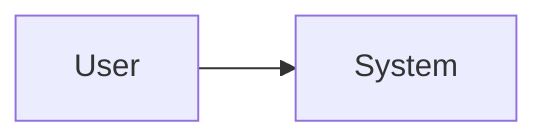
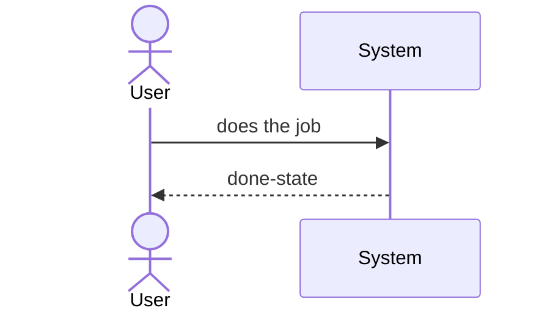

# Diagrams

## Context

Who talks to what for v0 of **this** slice.

```mermaid
flowchart LR
  user[User] --> app[System]
```

## v0 sequence

Happy path a stranger can follow.

```mermaid
sequenceDiagram
  actor User
  participant System
  User->>System: does the job
  System-->>User: done-state
```
