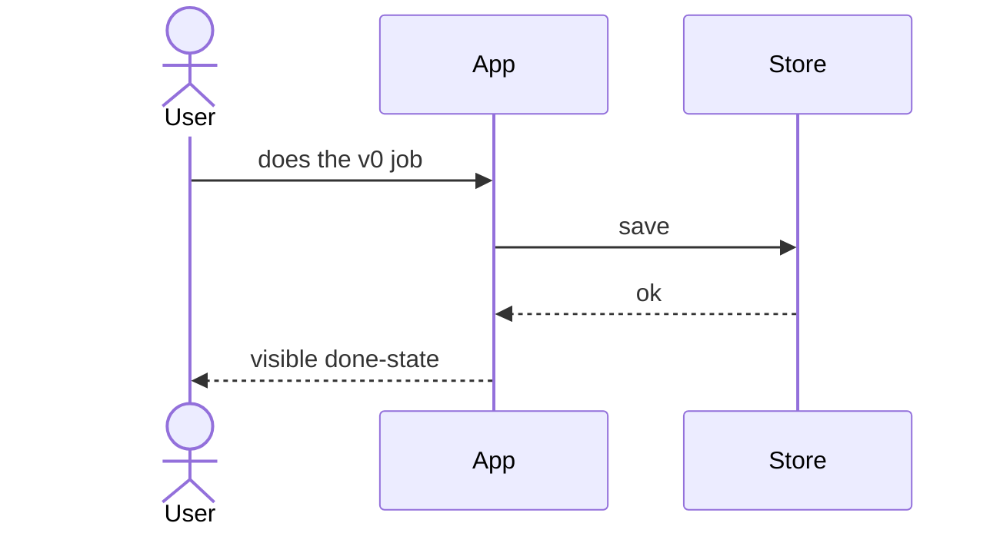

# Diagrams

Write `docs/specs/<slug>/diagrams.md`. Each diagram: one heading, one sentence of what it is for, then a fenced block.

## Prefer Mermaid

Use mermaid when the view is a graph, sequence, or state machine:

| View | Type |
| --- | --- |
| Who talks to what (system context) | `flowchart LR` or `C4Context`-style flowchart |
| v0 happy path / failure path | `sequenceDiagram` |
| Lifecycle of the main entity | `stateDiagram-v2` |
| Entities and relations | `erDiagram` |
| Deploy/runtime boxes | `flowchart TB` |

Keep node labels short. Do not dump class fields into a flowchart.



## Prefer ASCII

Use a `text` fence when mermaid is worse:

- Directory / module trees
- Fixed-width tables of fields
- CLI or TUI layout
- A single linear pipeline that is clearer as `A -> B -> C`

```text
user -> [web] -> [api] -> [(db)]
                 \-> [worker] -> [(queue)]
```

Never duplicate the same view as both mermaid and ascii unless the ascii is a one-line summary of a busy mermaid.

## Required vs optional

**Required for ideas-to-spec:** context + v0 sequence.

**Add if needed:** state of the core noun, data ownership, trust boundary (what is trusted vs user-controlled).

**Skip:** class diagrams, every microservice, CI/CD, unless the bundle is about those.

If a diagram encodes a decision (e.g. client talks only to BFF), that decision needs an ADR or it stays “proposed” in the diagram caption.
