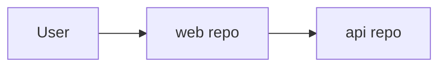

# Diagrams (landscape)

Write `docs/system/diagrams.md`. Each diagram: one heading, one sentence of what it is for, then a fenced block.

## Prefer Mermaid

System context across **repos** is required. Use `flowchart LR` (or C4-style flowchart). Keep node labels short.

Slice-level sequences belong in `docs/specs/<slug>/diagrams.md`, not here.

## Prefer ASCII

Use a `text` fence for repo/module trees or a one-line pipeline.

Never duplicate the same view as both mermaid and ascii unless the ascii is a one-line summary.

If a diagram encodes a cross-cutting decision, that decision needs a landscape ADR or the caption stays “proposed.”
