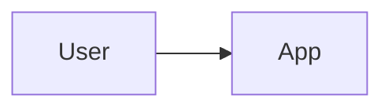

# Picture update

The picture is three places in `docs/system/`:

1. **Short description** — the paragraph under `# System landscape` in `landscape.md`, before the first `##`.
2. **Diagram** — the context diagram in `diagrams.md` (one heading, one sentence, one fence).
3. **How the parts connect** — `## How the parts connect` in `landscape.md`.

File shape: this skill’s `assets/landscape.md` and `assets/diagrams.md` (same files as `docs/system/_template/landscape.md` and `docs/system/_template/diagrams.md`; drop-in: `.claude/skills/crav1-keep-current/assets/`; plugin: this skill’s `assets/`).

Add what is new. Do not rewrite what is already there. Do not design a change. Do not build it. Do not write `glossary.md`. Do not edit `spec.md`, `plan.md`, `tasks.md`, `repos.md`, `adr/`, `security.md`, or application code.

## What counts as new

A **part** is a slice, a repo, or a named system the source already names.

A **connection** is a line the source already states about which part talks to which (talks to, calls, sends, reads from). A line the source states as “does not” is a connection too.

The source is the text this pass is allowed to use:

- Alone (`/crav1-keep-current`): each `docs/specs/<slug>/spec.md` (skip `_template`). Use the title and the paragraphs already written. Skip a sentence marked inferred.
- From a caller: only what that pass added (the new spec, or the confirmed new quotes). Skip inferred. Do not scan the repo for a part the source did not name.

If the source does not state the part or the connection, it is not new. Do not infer it from code.

## Short description

The template sentence `What this product/system is, in one short paragraph.` is empty. When that sentence is the whole paragraph, replace it with one sentence the source already supports.

When any other sentence is already there, keep every sentence. If a new part is not already named in that paragraph, add one sentence at the end that names it. One new sentence per new part. Do not merge those sentences into a rewrite of the paragraph. Do not rephrase a sentence that is already there.

## Diagram

Keep the heading and the one sentence above the fence. Edit inside the fence.

The template fence is empty:

When the fence is still that sample and the source names real parts, replace the sample body with the nodes and edges the source states. One fence. Do not add a second diagram.

When any other node or edge is already there, keep every existing line. Append a node or an edge the source states and the fence does not already show. Do not rename a node. Do not redraw the fence. Do not invent a service.

When `diagrams.md` is missing and `docs/system/` already exists, write it from `assets/diagrams.md`, then apply the empty-fence rule. Do not create `docs/system/` to do that.

## How the parts connect

When `## How the parts connect` is missing, add that heading and this line under it:

`Connections the notes already state. One line each. Add a line. Do not rewrite a line that is already here.`

Do not move other sections. Do not rewrite them.

Append one bullet per new connection the source states that is not already a bullet. Do not edit a bullet that is already there. Do not delete the intro line.

## Nothing new

When every new part is already named in the short description and the diagram, and every new connection is already a bullet, write nothing. Say the picture is current.
