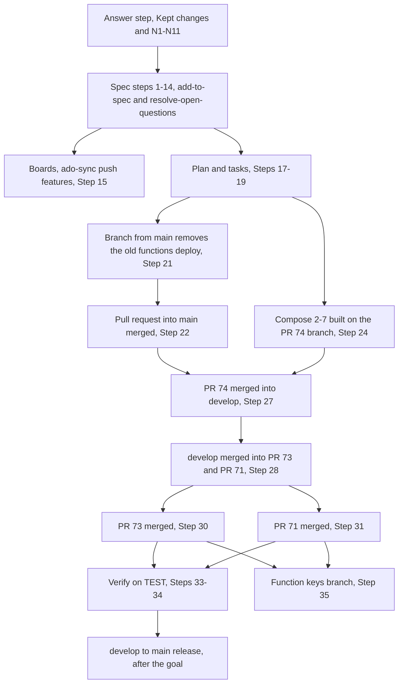
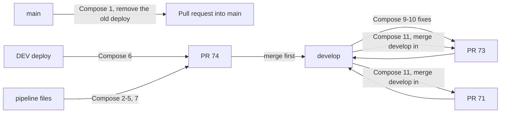

# Golden: playbook order diagrams (1.110.0)

The two order diagrams from a real playbook run, rewritten with the safe diagram syntax. Kit CI parses them with mermaid 11.4.1.

```mermaid
flowchart TD
  A[Answer step, Kept changes and N1-N11] --> B[Spec steps 1-14, add-to-spec and resolve-open-questions]
  B --> C[Boards, ado-sync push features, Step 15]
  B --> D[Plan and tasks, Steps 17-19]
  D --> E[Branch from main removes the old functions deploy, Step 21]
  E --> F[Pull request into main merged, Step 22]
  D --> G[Compose 2-7 built on the PR 74 branch, Step 24]
  F --> H[PR 74 merged into develop, Step 27]
  G --> H
  H --> I[develop merged into PR 73 and PR 71, Step 28]
  I --> J[PR 73 merged, Step 30]
  I --> K[PR 71 merged, Step 31]
  J --> L[Verify on TEST, Steps 33-34]
  K --> L
  J --> M[Function keys branch, Step 35]
  K --> M
  L --> N[develop to main release, after the goal]
```

```mermaid
flowchart LR
  mn[main] -->|Compose 1, remove the old deploy| mnpr[Pull request into main]
  dv[DEV deploy] -->|Compose 6| p74[PR 74]
  pl[pipeline files] -->|Compose 2-5, 7| p74
  dvl[develop] -->|Compose 9-10 fixes| p73[PR 73]
  p74 -->|merge first| dvl
  dvl -->|Compose 11, merge develop in| p73
  dvl -->|Compose 11, merge develop in| p71[PR 71]
  p73 --> dvl
  p71 --> dvl
```
