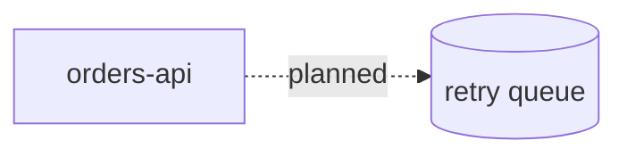

# Draft diagrams: queue-in-orders-api

Sandbox only. Not the live system or slice diagrams.

## Where a failed payment waits before retry

```mermaid
flowchart LR
  A[orders-api] -.->|planned| Q[(retry queue)]
```
